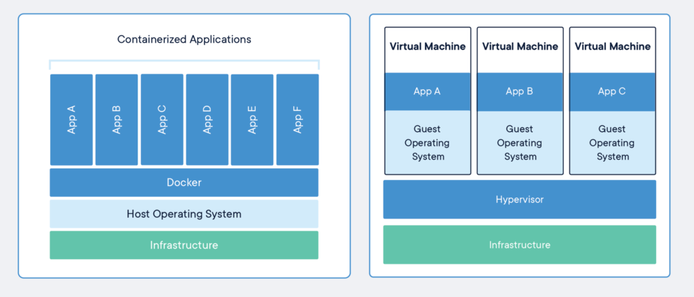
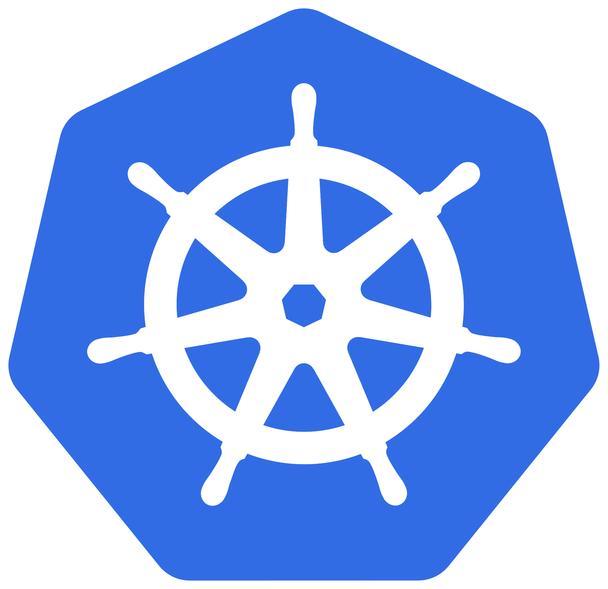
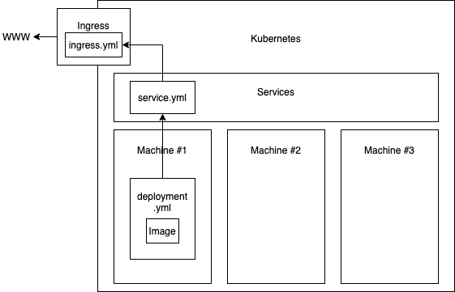

# MAD platform

## Containerization and orchestration

---

# Docker


---

## Container ? VM ?



---

## Run a container

```shell
docker run -d -p 8080:80 -v $PWD:/usr/share/nginx/html:ro --name example-1 nginx
```

### Remove it when done

```shell
docker rm -rf example-1
```

---

## Build and run a container

### Dockerfile

```
FROM nginx
COPY files /usr/share/nginx/html
```

---

## Build and run a container

### Build

```
docker build -t example2 .
```

---

## Build and run a container

### Run

```shell
docker run -d -p 8080:80 -name example-2 example2
```

---

## Repository

```shell
docker build -t itetechmadacr.azurecr.io/example3 .
docker push itetechmadacr.azurecr.io/example3
```

---

# Kubernetes




## Orchestration of containers

---

## Terms

* Namespace
* POD
* Replica Set
* Deployment
* Service
* Ingress

---

## Namespace

* A way to group things

---

## POD

* Smallest deployable unit
* One or more containers
* Run on the same "host" or node
  * Can see each other on the network via localhost
  * Can share storage

```shell
kubectl run example3 --generator=run-pod/v1
  --image itetechmadacr.azurecr.io/example3
  --namespace ...
```

---

## Replica Set

* Controls how many instances of a pod should be running

```shell
kubectl create -f replicaset.yaml --namespace ...
kubectl delete -f replicaset.yaml --namespace ...
```

---

## Deployment

* Package up pod and replica set in a declarative package

```shell
kubectl apply -f deployment.yaml --namespace ...
```

* Can be accessed by port forward

---

## Problems so far

* Kubernetes can stop and start any pod in a replica set to maintain the deployment
* How do we know the IP address of every running POD?

---

## Service

* Provides a constant IP/name for a deployment

```shell
kubectl apply -f service.yaml --namespace ...
```

* Can be accessed by port forward
* You can use NodePort type rather than ClusterIP to expose it

---

## Problems so far

* The service is running on an internal IP
* You could use NodePort - but - what to do if that node goes down and k8s starts the service on another node?

---

## Ingress

* Exposes your service to the network

```shell
kubectl apply -f ingress.yaml --namespace ...
```

---

## So - how did that hang together?



---

## Cleanup

```shell
kubectl delete -f ingress.yaml --namespace ...
kubectl delete -f service.yaml --namespace ...
kubectl delete -f deployment.yaml --namespace ...
```